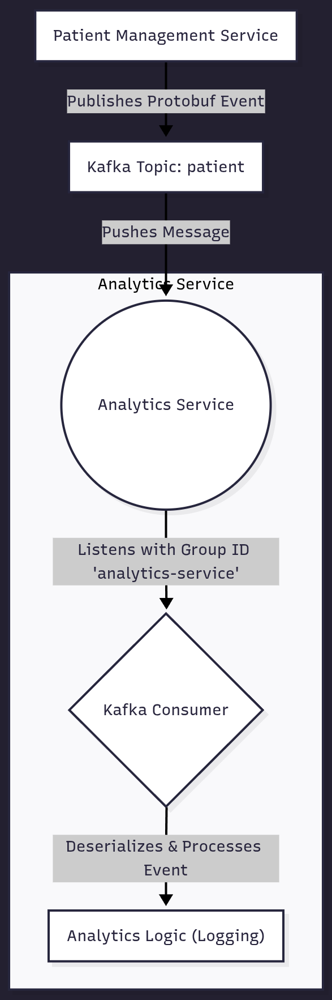

# Analytics Service

## 1. Overview

The Analytics Service is a lightweight, event-driven microservice designed to consume and process patient-related events from the system. Its primary role is to listen to a Kafka topic for events, such as patient creations, and perform analytical processing.

In its current implementation, the service consumes `PatientEvent` messages, deserializes them from their Protobuf format, and logs the key information. This serves as a foundational component that can be extended to feed data into a data warehouse, generate real-time metrics, or trigger other data-driven workflows.

## 2. Technology Stack

This service is built with a focus on asynchronous processing and stream consumption.

*   **Framework**: [Spring Boot](https://spring.io/projects/spring-boot) 3.x
*   **Language**: Java
*   **Messaging**: [Spring for Apache Kafka](https://spring.io/projects/spring-kafka) for consuming event streams.
*   **Data Serialization**: [Protocol Buffers (Protobuf)](https://developers.google.com/protocol-buffers) for deserializing event payloads.
*   **Containerization**: [Docker](https://www.docker.com/)
*   **Build Tool**: [Maven](https://maven.apache.org/)

## 3. Service Architecture

The Analytics Service operates as a downstream consumer in the system's event-driven architecture. It does not expose any API endpoints. Instead, it subscribes to the `patient` Kafka topic and processes messages asynchronously.

*   **Inbound Communication**: The service's only entry point is its Kafka consumer, which listens for messages published by upstream services like the Patient Management Service.
*   **Dependencies**: Its primary dependency is the Kafka broker cluster. It has no database or other service dependencies in its current form.



## 4. Running Locally

Follow these instructions to set up and run the service on your local machine.

### Prerequisites

*   Java JDK 17 or later
*   Maven 3.9+
*   Docker and Docker Compose (to run Kafka)

### Configuration

The application is configured using `application.properties` and can be overridden with environment variables.

| Environment Variable                      | `application.properties` Key                  | Description                                                                              | Default Value                                |
| ----------------------------------------- | ----------------------------------------------- | ---------------------------------------------------------------------------------------- | -------------------------------------------- |
| `SPRING_KAFKA_BOOTSTRAP_SERVERS`          | `spring.kafka.bootstrap-servers`                | Comma-separated list of Kafka broker addresses.                                          | `kafka:9092` or `localhost:9092`             |
| `SPRING_KAFKA_CONSUMER_GROUP_ID`          | `spring.kafka.consumer.group-id`                | The unique identifier for the consumer group.                                            | `analytics-service`                          |
| `SPRING_KAFKA_CONSUMER_AUTO_OFFSET_RESET` | `spring.kafka.consumer.auto-offset-reset`       | Policy for reading messages when no initial offset exists. `earliest` reads from the start. | `earliest`                                   |
| -                                         | `spring.kafka.consumer.key-deserializer`      | Deserializer for the message key.                                                        | `StringDeserializer`                         |
| -                                         | `spring.kafka.consumer.value-deserializer`    | Deserializer for the message value. `ByteArrayDeserializer` is used for Protobuf.      | `ByteArrayDeserializer`                      |

### Build and Run

1.  **Start Dependencies:**
    You need a running Kafka instance. You can use the `docker-compose.yml` from the Patient Management Service or run the following:
    ```yaml
    # docker-compose.yml
    version: '3.8'
    services:
      zookeeper:
        image: confluentinc/cp-zookeeper:7.0.1
        container_name: zookeeper
        environment:
          ZOOKEEPER_CLIENT_PORT: 2181
      kafka:
        image: confluentinc/cp-kafka:7.0.1
        container_name: kafka
        depends_on: [zookeeper]
        ports: ["9092:9092"]
        environment:
          KAFKA_BROKER_ID: 1
          KAFKA_ZOOKEEPER_CONNECT: 'zookeeper:2181'
          KAFKA_LISTENER_SECURITY_PROTOCOL_MAP: PLAINTEXT:PLAINTEXT,PLAINTEXT_INTERNAL:PLAINTEXT
          KAFKA_ADVERTISED_LISTENERS: PLAINTEXT://localhost:9092,PLAINTEXT_INTERNAL://kafka:29092
          KAFKA_OFFSETS_TOPIC_REPLICATION_FACTOR: 1
    ```
    ```bash
    docker-compose up -d
    ```
2.  **Clone and Build the project:**
    ```bash
    git clone <repository-url>
    cd analytics-service
    mvn clean package
    ```
3.  **Run the application:**
    ```bash
    mvn spring-boot:run
    ```
The service will start and immediately begin listening for messages on the `patient` topic.

### Docker Setup

You can containerize the service using a standard multi-stage `Dockerfile`.

```dockerfile
# Stage 1: Build the application with Maven
FROM maven:3.9.9-eclipse-temurin-21 AS builder

WORKDIR /app

COPY pom.xml .
RUN mvn dependency:go-offline -B

COPY src ./src
RUN mvn clean package -DskipTests

# Stage 2: Create the final, smaller runtime image
FROM openjdk:21-jdk-slim AS runner

WORKDIR /app

COPY --from=builder /app/target/analytics-service-0.0.1-SNAPSHOT.jar ./app.jar

ENTRYPOINT ["java", "-jar", "app.jar"]
```

**To build and run the Docker image:**
```bash
# Build the image
docker build -t analytics-service .

# Run the container (assuming kafka is running on the same docker network)
docker run --name analytics-service --network=<your_network_name> \
  -e SPRING_KAFKA_BOOTSTRAP_SERVERS=kafka:9092 \
  analytics-service
```

## 5. Core Functionality

### Kafka Consumer

The service contains a single consumer method annotated with `@KafkaListener`.
*   **Topic**: `patient`
*   **Consumer Group ID**: `analytics-service`
*   **Payload Handling**: The consumer is configured to receive the raw message value as a byte array (`byte[]`). This is necessary because the message is serialized using Protobuf, not a standard format like JSON.

### Event Processing

When a message is received:
1.  The `byte[]` payload is passed to the `consumeEvent` method.
2.  The method attempts to deserialize the byte array into a `PatientEvent` object using `PatientEvent.parseFrom(event)`.
3.  If successful, it logs the `patientId`, `name`, and `email` from the event.
4.  If deserialization fails (e.g., due to a malformed message), an error is logged.

## 6. Integration Contract (Protobuf)

The service relies on the `PatientEvent` schema to understand the messages it consumes. This contract is shared with producer services.

**`patient_event.proto`**

```proto
syntax = "proto3";

package patient.events;
option java_multiple_files = true;

message PatientEvent {
  string patientId = 1;
  string name = 2;
  string email = 3;
  string event_type = 4;
}
