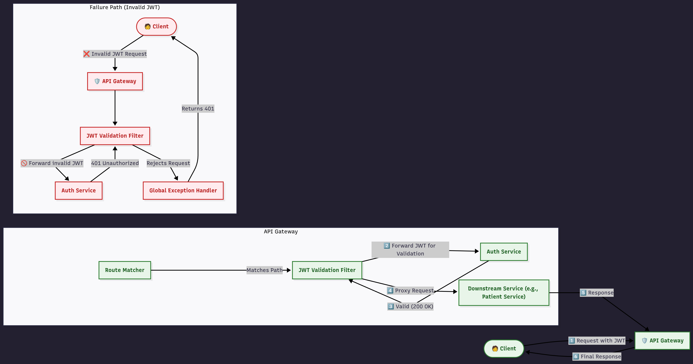

# API Gateway Service

## 1. Overview

The API Gateway is the single entry point for all external client requests into the microservices ecosystem. It acts as a reverse proxy, intelligently routing incoming requests to the appropriate downstream service.

Its key responsibilities include:
*   **Request Routing**: Directing traffic based on URL paths to internal services like the Auth Service and Patient Management Service.
*   **Centralized Security**: Enforcing authentication by validating JSON Web Tokens (JWT) for protected routes.
*   **Decoupling**: Hiding the internal network topology from the client, allowing services to be added, removed, or scaled without affecting client-side code.
*   **Cross-Cutting Concerns**: Serving as a central point for applying filters, rate limiting, and logging.

This service is built on a reactive stack, ensuring high performance and non-blocking I/O, which is essential for a high-throughput gateway.

## 2. Technology Stack

*   **Framework**: [Spring Boot](https://spring.io/projects/spring-boot) 3.x
*   **Gateway**: [Spring Cloud Gateway](https://spring.io/projects/spring-cloud-gateway) for reactive routing.
*   **Reactive Stack**: [Project Reactor](https://projectreactor.io/) / Spring WebFlux.
*   **HTTP Client**: Reactive `WebClient` for making non-blocking calls to the Authentication Service.
*   **Containerization**: [Docker](https://www.docker.com/)

## 3. Architecture and Request Flow

The API Gateway sits at the edge of the network. All external traffic (from a web/mobile client) must pass through it.

### Core Concepts
*   **Routes**: A route is the basic building block, defined by an ID, a destination URI, a set of predicates, and a list of filters.
*   **Predicates**: These are conditions that must be met for a request to be matched to a route. In this service, we use `Path` predicates to match based on the request URL.
*   **Filters**: These are applied to requests before they are sent to the downstream service or to the response on its way back. This gateway uses built-in filters (`StripPrefix`, `RewritePath`) and a custom filter (`JwtValidation`).

### Authentication Flow with `JwtValidation` Filter

For protected routes, the gateway performs the following steps:
1.  A client sends a request to the gateway (e.g., `/api/patients`) with an `Authorization: Bearer <JWT>` header.
2.  The gateway matches the request to a route that includes the `JwtValidation` filter.
3.  The filter intercepts the request and extracts the JWT.
4.  It makes a reactive, non-blocking `GET` call to the `auth-service` at its `/validate` endpoint, forwarding the `Authorization` header.
5.  **If the token is valid**, the `auth-service` returns `200 OK`. The filter chain proceeds, and the gateway proxies the original request to the downstream service (e.g., `patient-service`).
6.  **If the token is invalid**, the `auth-service` returns `401 Unauthorized`. This triggers an exception in the gateway's `WebClient`, which is caught by the global exception handler, and the gateway immediately returns a `401 Unauthorized` response to the client without ever contacting the downstream service.



## 4. Running Locally

### Prerequisites

*   Docker and Docker Compose
*   A running instance of the `auth-service` and `patient-service`.

### Configuration

The gateway's configuration is managed in `application.yml` and can be overridden with environment variables.

| Environment Variable | `application.yml` Key   | Description                                 | Example Value                 |
| -------------------- | ----------------------- | ------------------------------------------- | ----------------------------- |
| `SERVER_PORT`        | `server.port`           | The port the gateway listens on.            | `4004`                        |
| `AUTH_SERVICE_URL`   | `auth.service.url`      | The base URL of the Authentication Service. | `http://auth-service:4005`    |

### Docker Compose Setup (Recommended)

The gateway is designed to run in a containerized environment with its dependent services. Here is an example `docker-compose.yml` snippet that includes the gateway.

```yaml
version: '3.8'

services:
  auth-service:
    # ... auth-service configuration ...
    ports:
      - "4005:4005"

  patient-service:
    # ... patient-service configuration ...
    ports:
      - "4000:4000"

  api-gateway:
    build: . # Assuming Dockerfile is in the current directory
    container_name: api-gateway
    ports:
      - "4004:4004"
    depends_on:
      - auth-service
      - patient-service
    environment:
      - AUTH_SERVICE_URL=http://auth-service:4005```
**To run the entire stack:**
```bash
docker-compose up --build
```
The API Gateway will be accessible at `http://localhost:4004`.

## 5. Routing Rules

The routing logic is defined in `application.yml`.

| Route ID                 | Path Predicate          | Destination URI                | Filters                                          | Description                                                                                             |
| ------------------------ | ----------------------- | ------------------------------ | ------------------------------------------------ | ------------------------------------------------------------------------------------------------------- |
| `auth-service-route`     | `/auth/**`              | `http://auth-service:4005`     | `StripPrefix=1`                                  | Routes requests like `/auth/login` to `/login` on the Auth Service. No JWT validation is needed.        |
| `patient-service-route`  | `/api/patients/**`      | `http://patient-service:4000`  | `StripPrefix=1`, `JwtValidation`                 | Routes requests like `/api/patients/123` to `/patients/123` on the Patient Service. **JWT is required.** |
| `api-docs-patient-route` | `/api-docs/patients`    | `http://patient-service:4000`  | `RewritePath`, `JwtValidation`                   | Routes `/api-docs/patients` to `/v3/api-docs` on Patient Service for Swagger UI. **JWT is required.**   |

### Filter Explanations
*   **`StripPrefix=1`**: Removes the first path segment. For example, `/auth/login` becomes `/login`.
*   **`JwtValidation`**: The custom filter that triggers the call to the Auth Service to validate the token.
*   **`RewritePath`**: Rewrites the path based on a regular expression. Here, it maps the public API docs path to the internal Springdoc path.

## 6. Error Handling

The service includes a global exception handler (`JwtValidationException`) for a clean user experience.
*   **`@RestControllerAdvice`**: This annotation allows centralized exception handling across the application.
*   **Handler Logic**: It specifically catches `WebClientResponseException.Unauthorized`. This exception is thrown by the `WebClient` inside the `JwtValidation` filter when the `auth-service` returns a `401` status.
*   **Outcome**: Instead of a verbose `500 Internal Server Error`, the handler ensures that the gateway returns a clean `401 Unauthorized` status code to the original client, correctly indicating an authentication failure.