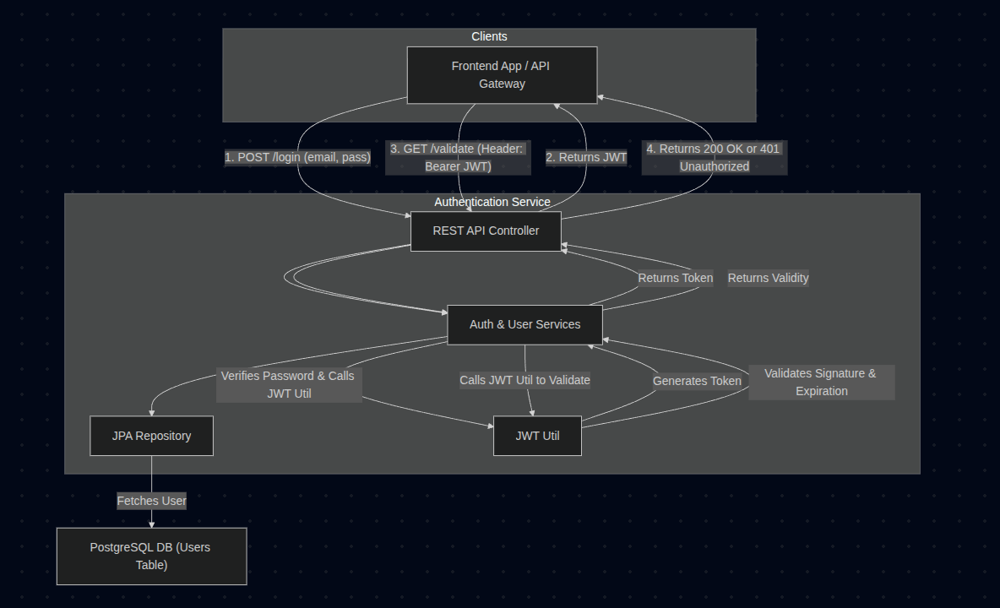

# Authentication Service

## 1. Overview

The Authentication Service is a central microservice responsible for user authentication and authorization within the system. It provides a secure way for users to log in and for other services to validate access tokens.

The core functionalities include:
1.  **User Authentication**: Validating user credentials (email and password) against a dedicated user database.
2.  **JWT Generation**: Issuing JSON Web Tokens (JWT) upon successful authentication. These tokens contain user identity information (email and role) and have a defined expiration time.
3.  **JWT Validation**: Exposing an endpoint that allows API Gateways or other microservices to verify the authenticity and validity of a JWT.

This service acts as the security gatekeeper for the entire application ecosystem.

## 2. Technology Stack

This service is built using a robust, security-focused Java stack.

*   **Framework**: [Spring Boot](https://spring.io/projects/spring-boot) 3.x
*   **Language**: Java
*   **Security**:
    *   [Spring Security](https://spring.io/projects/spring-security) for password hashing (`BCryptPasswordEncoder`).
    *   [Java JWT (jjwt)](https://github.com/jwtk/jjwt) for creating and parsing JSON Web Tokens.
*   **Database**: [Spring Data JPA](https://spring.io/projects/spring-data-jpa) with Hibernate, connected to a PostgreSQL database.
*   **API**: Spring Web for creating RESTful endpoints.
*   **Validation**: Jakarta Bean Validation for request data validation.
*   **Containerization**: [Docker](https://www.docker.com/)
*   **Build Tool**: [Maven](https://maven.apache.org/)

## 3. Service Architecture

The Authentication Service is a standalone component that holds its own user credential database. It is designed to be called by an API Gateway or a frontend client.

*   **Inbound Communication**: Exposes a REST API for login and token validation.
*   **Database**: Connects to its own PostgreSQL database which contains a `users` table for storing emails, hashed passwords, and roles.
*   **Outbound Communication**: Does not directly communicate with other services. It returns JWTs to its callers, which then use those tokens to access other protected services.


## 4. Running Locally

Follow these instructions to set up and run the service on your local machine.

### Prerequisites

*   Java JDK 17 or later
*   Maven 3.9+
*   Docker and Docker Compose

### Configuration

The application is configured using environment variables.

| Environment Variable             | Description                                                   | Example Value                                              |
| -------------------------------- | ------------------------------------------------------------- | ---------------------------------------------------------- |
| `SPRING_DATASOURCE_URL`          | The JDBC URL for the PostgreSQL database.                     | `jdbc:postgresql://auth-service-db:5432/db`                |
| `SPRING_DATASOURCE_USERNAME`     | Username for the database.                                    | `admin_user`                                               |
| `SPRING_DATASOURCE_PASSWORD`     | Password for the database.                                    | `password`                                                 |
| `SPRING_JPA_HIBERNATE_DDL_AUTO`  | Hibernate DDL mode.                                           | `update`                                                   |
| `JWT_SECRET`                     | A Base64-encoded secret key for signing JWTs. **Must be strong.** | `TXlTdXBlclNlY3JldEtleUZvckp3dEVuY29kaW5nX0NoYW5nZVRoaXMxMjMh` |

### Database Setup

The service requires a PostgreSQL database. You can run one easily using Docker Compose.

1.  **Create a `docker-compose.yml` file:**
    ```yaml
    version: '3.8'
    services:
      auth-service-db:
        image: postgres:14
        container_name: auth-service-db
        environment:
          POSTGRES_USER: admin_user
          POSTGRES_PASSWORD: password
          POSTGRES_DB: db
        ports:
          - "5433:5432" # Use a different host port to avoid conflicts
        volumes:
          - auth_postgres_data:/var/lib/postgresql/data
    volumes:
      auth_postgres_data:
    ```
2.  **Start the database:**
    ```bash
    docker-compose up -d
    ```

### Build and Run

1.  **Clone the repository and navigate to the service directory.**
2.  **Build the project:**
    ```bash
    mvn clean package
    ```
3.  **Run the application:**
    Ensure you have the environment variables set in your IDE or shell.
    ```bash
    # Example for local run (update JDBC URL to localhost)
    export SPRING_DATASOURCE_URL=jdbc:postgresql://localhost:5433/db
    # ... set other env vars
    mvn spring-boot:run
    ```
The service will start on port `8080` by default.

## 5. API Endpoints

| Method   | Endpoint          | Description                                | Request Body                                | Success Response          | Failure Response    |
| :------- | :---------------- | :----------------------------------------- | :------------------------------------------ | :------------------------ | :------------------ |
| `POST`   | `/login`          | Authenticates a user and returns a JWT.    | `LoginRequestDTO`                           | `200 OK` with JWT         | `401 Unauthorized`  |
| `GET`    | `/validate`       | Validates a JWT passed in the header.      | -                                           | `200 OK`                  | `401 Unauthorized`  |

---
**`POST /login`**

Authenticates a user with their email and password.

*   **Request Body (`LoginRequestDTO`)**:
    ```json
    {
      "email": "user@example.com",
      "password": "password123"
    }
    ```
*   **Success Response (`LoginResponseDTO`)**:
    ```json
    {
      "token": "eyJhbGciOiJIUzI1NiJ9.eyJzdWIiOiJ1c2VyQGV4YW1wbGUuY29tIiwicm9sZSI6IlVTRVIiLCJpYXQiOjE2N..."
    }
    ```

**`GET /validate`**

Checks if a provided JWT is valid (i.e., has a valid signature and is not expired).

*   **Request Header**: The token must be provided in the `Authorization` header.
    ```
    Authorization: Bearer <your-jwt-token>
    ```
*   **Success Response**: An empty body with an HTTP `200 OK` status.
*   **Failure Response**: An empty body with an HTTP `401 Unauthorized` status.

## 6. Security and JWT Details

### JWT Generation
*   **Algorithm**: The token is signed using HMAC with SHA keys (`HS256` or stronger, depending on key size).
*   **Secret Key**: The signing key is derived from the `JWT_SECRET` environment variable, which **must** be a Base64-encoded string.
*   **Claims**: The JWT payload includes:
    *   `sub` (Subject): The user's email.
    *   `role`: A custom claim containing the user's role (e.g., "USER", "ADMIN").
    *   `iat` (Issued At): The timestamp when the token was created.
    *   `exp` (Expiration): The timestamp when the token expires. The current lifetime is set to **10 hours**.

### Password Storage
*   The service uses Spring Security's `BCryptPasswordEncoder` to securely hash and salt user passwords. Passwords are never stored in plaintext.

### Security Configuration
*   The `SecurityConfig` class disables CSRF protection (common for stateless APIs) and configures the authorization rules to `permitAll()`. This means the service itself is not protected; its purpose is to provide authentication decisions for other services. An API Gateway would call `/validate` to protect downstream resources.