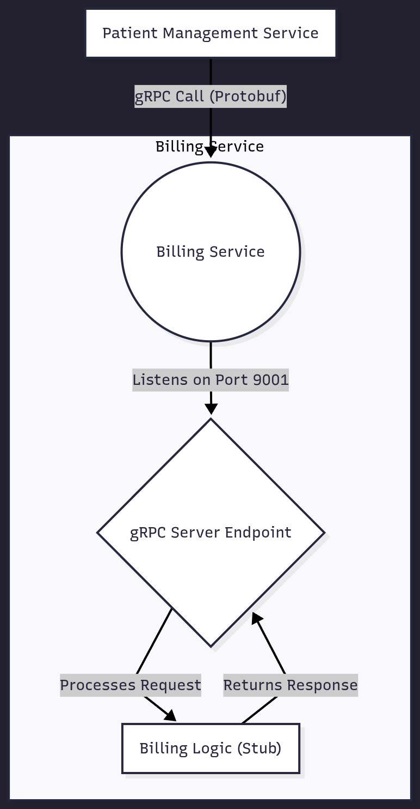

# Billing Service

## 1. Overview

The Billing Service is a specialized microservice responsible for creating and managing billing accounts for patients. It exposes a gRPC endpoint that is called by other services, such as the Patient Management Service, whenever a new patient is registered in the system.

The primary function of this service is to receive patient information, create a corresponding billing account, and return a unique account identifier.

**Note:** The current implementation is a functional stub. It acknowledges requests and returns a hardcoded successful response. It does not yet include a database connection or business logic for persisting billing accounts.

## 2. Technology Stack

This service is built using a modern Java stack, focusing on performance and type-safe communication.

*   **Framework**: [Spring Boot](https://spring.io/projects/spring-boot) 3.x
*   **Language**: [Java 21](https://www.oracle.com/java/technologies/javase/jdk21-archive-downloads.html)
*   **API / Communication**: [gRPC](https://grpc.io/) for synchronous, high-performance RPC.
*   **gRPC/Spring Integration**: [grpc-spring-boot-starter](https://github.com/yidongnan/grpc-spring-boot-starter) (`net.devh.boot.grpc`) for seamless integration of the gRPC server within the Spring ecosystem.
*   **Schema Definition**: [Protocol Buffers (Protobuf)](https://developers.google.com/protocol-buffers) for defining the service contract.
*   **Containerization**: [Docker](https://www.docker.com/)
*   **Build Tool**: [Maven](https://maven.apache.org/)

## 3. Service Architecture

The Billing Service is designed to be a simple, focused gRPC server. It acts as a downstream service, responding to requests from other internal services.

*   **Inbound Communication**: It listens for incoming gRPC requests on a dedicated port (`9001` by default). It does not expose any RESTful endpoints for its core functionality.
*   **Dependencies**: In its current state, the service is fully self-contained and has no external dependencies like a database or other services. In a production version, it would connect to a dedicated billing database.



## 4. Running Locally

Follow these instructions to set up and run the service on your local machine.

### Prerequisites

*   Java JDK 21 or later
*   Maven 3.9+
*   Docker (Optional, for containerization)

### Configuration

The application is configured using `application.properties` or environment variables.

| Environment Variable | `application.properties` Key | Description                             | Default Value |
| -------------------- | ---------------------------- | --------------------------------------- | ------------- |
| `SERVER_PORT`        | `server.port`                | The port for the embedded HTTP server.  | `4001`        |
| `GRPC_SERVER_PORT`   | `grpc.server.port`           | The port the gRPC server listens on.    | `9001`        |

### Build and Run

1.  **Clone the repository:**
    ```bash
    git clone <repository-url>
    cd billing-service
    ```
2.  **Build the project:**
    This command will also generate the gRPC Java classes from the `.proto` file.
    ```bash
    mvn clean package
    ```
3.  **Run the application:**
    ```bash
    mvn spring-boot:run
    ```
The gRPC server will start on port `9001`, and the HTTP server (for Spring Boot Actuator, etc.) will be available on port `4001`.

### Docker Setup

You can containerize the service using the following `Dockerfile`.

```dockerfile
# Stage 1: Build the application with Maven
FROM maven:3.9.9-eclipse-temurin-21 AS builder

WORKDIR /app

COPY pom.xml .
# Download dependencies first to leverage Docker cache
RUN mvn dependency:go-offline -B

COPY src ./src

# Build the application JAR
RUN mvn clean package -DskipTests

# Stage 2: Create the final, smaller runtime image
FROM openjdk:21-jdk-slim AS runner

WORKDIR /app

# Copy the JAR from the builder stage
COPY --from=builder /app/target/billing-service-0.0.1-SNAPSHOT.jar ./app.jar

# Expose both the HTTP and gRPC ports
EXPOSE 4001
EXPOSE 9001

ENTRYPOINT ["java", "-jar", "app.jar"]
```

**To build and run the Docker image:**
```bash
# Build the image
docker build -t billing-service .

# Run the container
docker run -p 4001:4001 -p 9001:9001 --name billing-service billing-service
```

## 5. gRPC API Endpoint

The service provides a single gRPC endpoint for creating billing accounts.

### Contract Definition (`billing_service.proto`)

The communication contract is defined using Protocol Buffers.

```proto
syntax = "proto3";

option java_multiple_files = true;
option java_package = "billing";

service BillingService {
  rpc CreateBillingAccount (BillingRequest) returns (BillingResponse);
}

message BillingRequest{
  string patientId = 1;
  string name = 2;
  string email = 3;
}
message BillingResponse{
  string accountId = 1;
  string status = 2;
}
```

### Core Functionality: `CreateBillingAccount`

*   **Description**: Receives a `BillingRequest` containing patient details.
*   **Request (`BillingRequest`)**:
    *   `patientId`: The unique identifier of the patient.
    *   `name`: The full name of the patient.
    *   `email`: The patient's email address.
*   **Response (`BillingResponse`)**:
    *   `accountId`: The identifier for the newly created billing account (currently hardcoded to `"1233"`).
    *   `status`: The status of the account (currently hardcoded to `"ACTIVE"`).
*   **Behavior**: Logs the incoming request details, constructs a static `BillingResponse`, and sends it back to the client.
