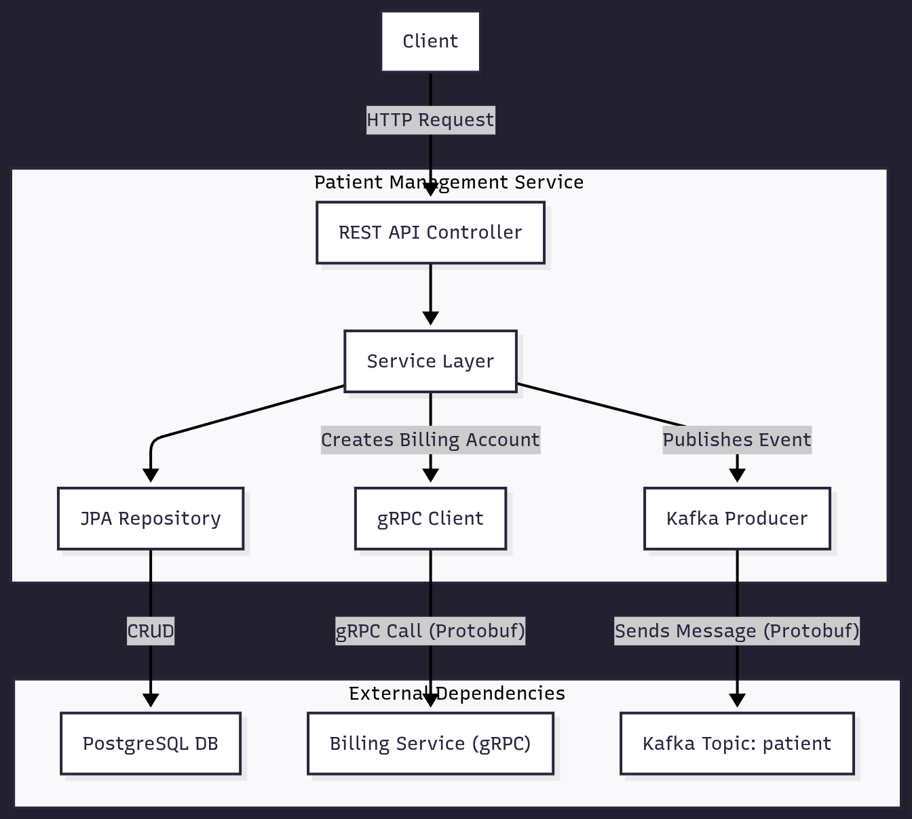

Of course. I have integrated the Protobuf definitions for the gRPC and Kafka contracts into the documentation. Here is the completely updated `README.md`.

---

# Patient Management Service

## 1. Overview

The Patient Management Service is a microservice responsible for handling all operations related to patient data within the healthcare system. It provides a RESTful API for creating, reading, updating, and deleting (CRUD) patient records.

Upon the creation of a new patient, this service integrates with other parts of the system by:
1.  Making a synchronous gRPC call to the **Billing Service** to create a corresponding billing account, using a Protobuf-defined contract.
2.  Publishing an asynchronous event to a **Kafka topic** to notify other downstream services (e.g., appointment scheduling, medical records). The event payload is serialized using Protobuf.

This service is designed to be a single source of truth for patient demographic information.

## 2. Technology Stack

This service is built using a modern Java stack, leveraging the following technologies:

*   **Framework**: [Spring Boot](https://spring.io/projects/spring-boot) 3.x
*   **Language**: [Java 21](https://www.oracle.com/java/technologies/javase/jdk21-archive-downloads.html)
*   **Database**: [Spring Data JPA](https://spring.io/projects/spring-data-jpa) with Hibernate for ORM. Designed for use with a PostgreSQL database.
*   **API**: Spring Web for creating RESTful endpoints.
*   **API Documentation**: [Springdoc OpenAPI (Swagger)](https://springdoc.org/) for automated API documentation.
*   **Inter-service Communication**:
    *   [gRPC](https://grpc.io/): For synchronous RPC calls to the Billing Service.
    *   [Apache Kafka](https://kafka.apache.org/): For asynchronous, event-driven communication.
    *   [Protocol Buffers (Protobuf)](https://developers.google.com/protocol-buffers): For schema definition and data serialization.
*   **Validation**: Jakarta Bean Validation for request data validation.
*   **Containerization**: [Docker](https://www.docker.com/)
*   **Build Tool**: [Maven](https://maven.apache.org/)

## 3. Architecture

This service is a component of a larger microservices-based architecture.

*   **Inbound Communication**: It exposes a REST API that can be consumed by a frontend application, an API gateway, or other internal services.
*   **Database**: It connects to a dedicated PostgreSQL database to persist patient data. The connection is managed by Spring Data JPA.
*   **Outbound Communication**:
    *   **gRPC Client**: When a new patient is created, the service acts as a gRPC client, sending a request to the Billing Service to set up a billing account. Communication is defined by a `.proto` contract.
    *   **Kafka Producer**: After successfully creating a patient, it produces a `PatientEvent` message to the `patient` Kafka topic. The message schema is also defined by a `.proto` file.



## 4. Running Locally

Follow these instructions to set up and run the service on your local machine.

### Prerequisites

*   Java JDK 21 or later
*   Maven 3.9+
*   Docker and Docker Compose

### Configuration

The application is configured using environment variables.

| Environment Variable             | Description                                                   | Example Value                                       |
| -------------------------------- | ------------------------------------------------------------- | --------------------------------------------------- |
| `SPRING_DATASOURCE_URL`          | The JDBC URL for the PostgreSQL database.                     | `jdbc:postgresql://patient-service-db:5432/db`      |
| `SPRING_DATASOURCE_USERNAME`     | Username for the database.                                    | `admin_user`                                        |
| `SPRING_DATASOURCE_PASSWORD`     | Password for the database.                                    | `password`                                          |
| `SPRING_JPA_HIBERNATE_DDL_AUTO`  | Hibernate DDL mode (e.g., `update`, `validate`, `none`).      | `update`                                            |
| `SPRING_KAFKA_BOOTSTRAP_SERVERS` | Comma-separated list of Kafka broker addresses.               | `kafka:9092`                                        |
| `BILLING_SERVICE_ADDRESS`        | Hostname or IP of the Billing Service.                        | `billing-service`                                   |
| `BILLING_SERVICE_GRPC_PORT`      | The gRPC port for the Billing Service.                        | `9001`                                              |
| `SPRING_SQL_INIT_MODE`           | Database initialization mode.                                 | `always`                                            |

### Option 1: Run with Docker Compose (Recommended)

This is the easiest way to get the service and its dependencies running. Create a `docker-compose.yml` file in the project root:

```yaml
version: '3.8'

services:
  patient-service-db:
    image: postgres:14
    container_name: patient-service-db
    environment:
      POSTGRES_USER: admin_user
      POSTGRES_PASSWORD: password
      POSTGRES_DB: db
    ports:
      - "5432:5432"
    volumes:
      - postgres_data:/var/lib/postgresql/data

  zookeeper:
    image: confluentinc/cp-zookeeper:7.0.1
    container_name: zookeeper
    environment:
      ZOOKEEPER_CLIENT_PORT: 2181

  kafka:
    image: confluentinc/cp-kafka:7.0.1
    container_name: kafka
    depends_on:
      - zookeeper
    ports:
      - "9092:9092"
    environment:
      KAFKA_BROKER_ID: 1
      KAFKA_ZOOKEEPER_CONNECT: 'zookeeper:2181'
      KAFKA_LISTENER_SECURITY_PROTOCOL_MAP: PLAINTEXT:PLAINTEXT,PLAINTEXT_INTERNAL:PLAINTEXT
      KAFKA_ADVERTISED_LISTENERS: PLAINTEXT://localhost:9092,PLAINTEXT_INTERNAL://kafka:29092
      KAFKA_OFFSETS_TOPIC_REPLICATION_FACTOR: 1

  patient-service:
    build: .
    container_name: patient-service
    depends_on:
      - patient-service-db
      - kafka
    ports:
      - "4000:4000"
    environment:
      - SPRING_DATASOURCE_URL=jdbc:postgresql://patient-service-db:5432/db
      - SPRING_DATASOURCE_USERNAME=admin_user
      - SPRING_DATASOURCE_PASSWORD=password
      - SPRING_JPA_HIBERNATE_DDL_AUTO=update
      - SPRING_KAFKA_BOOTSTRAP_SERVERS=kafka:9092
      - BILLING_SERVICE_ADDRESS=billing-service # Replace with your billing service host
      - BILLING_SERVICE_GRPC_PORT=9001

volumes:
  postgres_data:
```

**To run:**
```bash
docker-compose up --build
```

The service will be available at `http://localhost:4000`.

### Option 2: Run with Maven and External Dependencies

If you prefer to run the application directly using Maven, you can start only the dependencies with Docker.

1.  **Start dependencies:**
    Use the `docker-compose.yml` from Option 1, but remove the `patient-service` definition.
    ```bash
    docker-compose up -d patient-service-db zookeeper kafka
    ```2.  **Set Environment Variables:**
    Configure your IDE or shell with the environment variables listed in the configuration table. Make sure to point to `localhost` for the database and Kafka.
3.  **Build and Run the Application:**
    ```bash
    # Build the project
    mvn clean package

    # Run the application
    mvn spring-boot:run
    ```

## 5. Integration Contracts (Protobuf)

This service uses Protocol Buffers to define the schemas for inter-service communication.

### gRPC Contract (Billing Service)

When a new patient is created, this service makes an RPC to the Billing Service using the following contract.

**`billing_service.proto`**
```proto
syntax = "proto3";

option java_multiple_files = true;
option java_package = "billing";

service BillingService {
  rpc CreateBillingAccount (BillingRequest) returns (BillingResponse);
}

message BillingRequest{
  string patientId = 1;
  string name = 2;
  string email = 3;
}
message BillingResponse{
  string accountId = 1;
  string status = 2;
}
```
*   **`BillingRequest`**: Contains the necessary patient details (`patientId`, `name`, `email`) to create a new billing account.
*   **`BillingResponse`**: Returns the `accountId` of the newly created account and its `status`.

### Kafka Event Schema (Patient Event)

After successfully creating a patient, a `PatientEvent` is published to the `patient` Kafka topic.

**`patient_event.proto`**
```proto
syntax="proto3";

package patient.events;
option java_multiple_files=true;

message PatientEvent {
  string patientId = 1;
  string name = 2;
  string email = 3;
  string event_type = 4;
}
```
*   **`PatientEvent`**: Carries information about the patient-related event. The `event_type` field (e.g., `"PATIENT_CREATED"`) allows consumers to filter and handle different types of events.

## 6. API Endpoints

The service exposes its API on port `4000`. Full interactive documentation is available via Swagger UI.

*   **Swagger UI URL**: [http://localhost:4000/swagger-ui.html](http://localhost:4000/swagger-ui.html)

All endpoints are available under the base path `/patients`.

| Method   | Endpoint          | Description                                | Request Body                                | Success Response |
| :------- | :---------------- | :----------------------------------------- | :------------------------------------------ | :--------------- |
| `GET`    | `/`               | Retrieves a list of all patients.          | -                                           | `200 OK`         |
| `POST`   | `/`               | Creates a new patient record.              | `PatientRequestDTO`                         | `200 OK`         |
| `PUT`    | `/{id}`           | Updates an existing patient by their UUID. | `PatientRequestDTO`                         | `200 OK`         |
| `DELETE` | `/{id}`           | Deletes a patient by their UUID.           | -                                           | `204 No Content` |

---
**`PatientRequestDTO` Example:**
```json
{
  "name": "John Doe",
  "email": "john.doe@example.com",
  "address": "123 Main St, Anytown, USA",
  "dateOfBirth": "1990-01-15"
}
```

**`PatientResponseDTO` Example:**
```json
{
  "id": "a1b2c3d4-e5f6-7890-1234-567890abcdef",
  "name": "John Doe",
  "email": "john.doe@example.com",
  "address": "123 Main St, Anytown, USA",
  "dateOfBirth": "1990-01-15"
}
```

### Error Handling

The service implements global exception handling for common errors:
*   **400 Bad Request**: Returned for validation errors (e.g., missing fields, invalid email format) or if a client tries to create a patient with an email that already exists.
*   **404 Not Found**: Returned if a client tries to update or delete a patient with a non-existent UUID.
